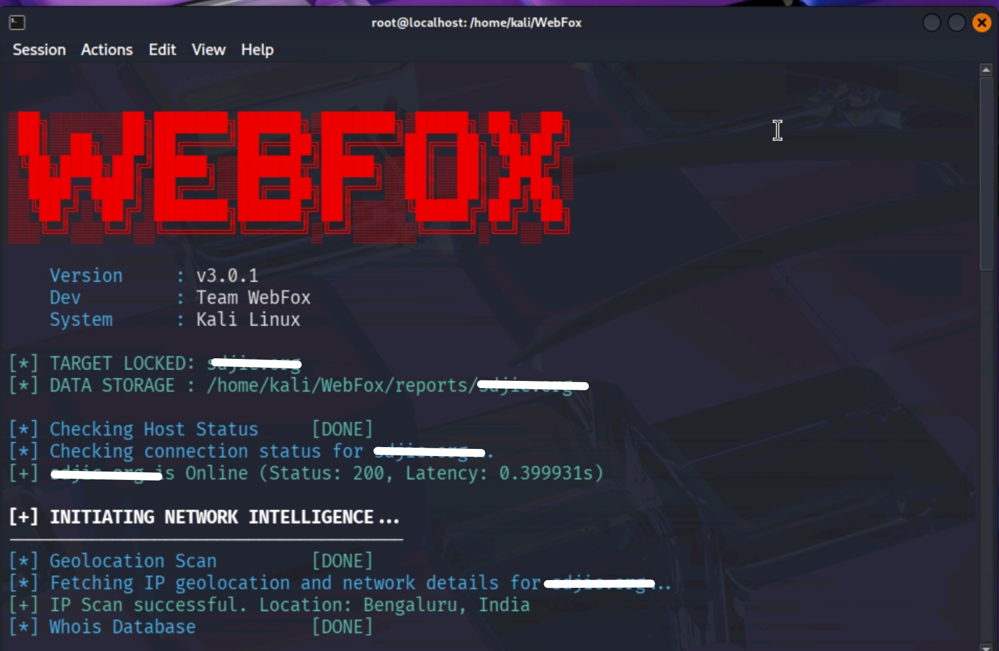

# 🦊 WebFox

WebFox is an **automated web reconnaissance and vulnerability scanning framework** designed for **ethical hackers, penetration testers, and bug bounty hunters**.  
It performs **domain scanning, data collection, and reporting**, and also provides a **GUI interface** for ease of use.

---

## 🚀 Key Features

- 🔍 Automated domain scanning
- 📊 Generates structured reports
- 📁 Saves results and snapshots automatically
- 🖥️ Command Line Interface (CLI)
- 🎨 Graphical User Interface (GUI) using Streamlit
- ⚡ Simple installation & execution
- 🐍 Built with Python

---

## 📦 Requirements

Before installation, make sure you have:

- Python **3.8 or above**
- Linux / Kali / Ubuntu / Termux
- Internet connection
- `git`, `chmod`, `bash`

---

## 🛠️ Installation Guide

### 1️⃣ Clone the Repository
```bash
git clone https://github.com/lucky-om/WebFox
```
2️⃣ Navigate to the Project Directory
```bash
cd WebFox
```
3️⃣ Give Execute Permissions
```bash
chmod +x *
```

4️⃣ Run the Installer
```bash
./install.sh
```
This script will automatically install all required dependencies.


---

▶️ Usage (CLI Mode)

🔹 Run Scan
```bash
python3 test.py example.com -scan
```
🔹 Description

Replace example.com with your target domain

The tool will start scanning automatically


---

📂 Results & Reports

After the scan completes:

📁 Results are saved inside:

WebFox/report/

Inside the report folder, you will find:

📄 Scan results

📊 Collected data

📸 Domain snapshots

📁 Organized output files


Everything related to the scan is stored there.


---

🖥️ GUI Mode (Streamlit)

WebFox also provides a Graphical User Interface.

▶️ Start GUI
```bash
streamlit run gui.py
```
🔹 GUI Features

Easy target input

One‑click scanning

Visual output

Beginner‑friendly interface


---

📸 Tool Screenshots

🔹 CLI Mode



🔹 GUI Mode


---

⚠️ Disclaimer

> WebFox is developed strictly for educational and authorized security testing purposes.


❌ Do NOT scan domains without permission

❌ Illegal use is strictly prohibited

✅ Use only on assets you own or are authorized to test


The developer holds no responsibility for misuse of this tool.


---

🧠 Use Cases

Bug Bounty Reconnaissance

Attack Surface Mapping

Security Assessment

Learning Ethical Hacking

Automation Practice


---

🤝 Contributing

Contributions are welcome!

1. Fork the repository


2. Create a new branch


3. Commit your changes


4. Open a Pull Request


---

👤 Author

Lucky
Krish
Jayesh
Aryan
Kunal
Shani
GitHub: https://github.com/lucky-om


---

⭐ Support

If you like this project:

⭐ Star the repository

🐛 Report issues

💡 Suggest improvements


---

📜 License

This project is licensed under the MIT License.
